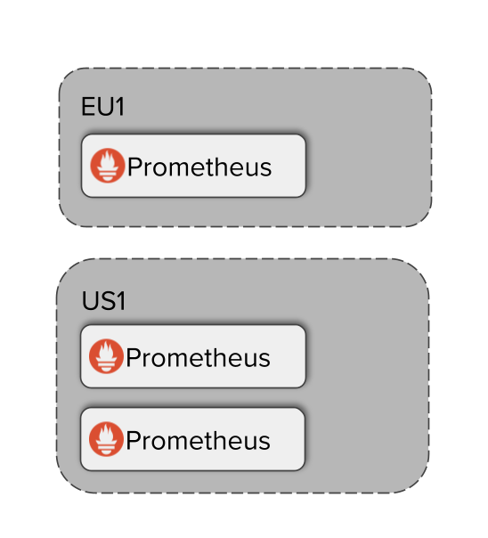
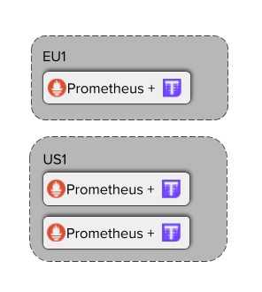
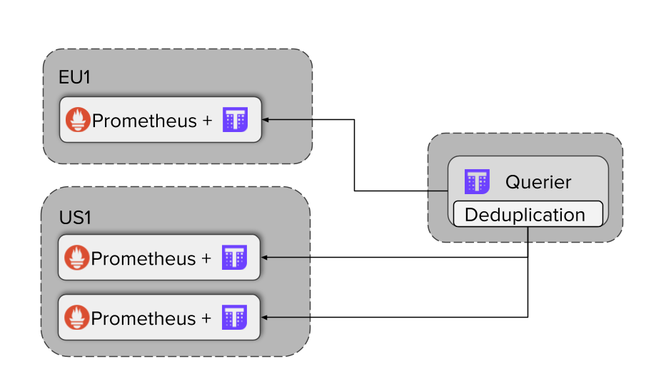

# Thanos
Thanos é um conjunto de componentes que podem ser compostos em um sistema métrico de alta disponibilidade com capacidade de armazenamento ilimitada, que pode ser adicionado perfeitamente nas implantações existentes do Prometheus.

Thanos é um projeto de incubação CNCF .

Thanos aproveita o formato de armazenamento do Prometheus 2.0 para armazenar dados métricos históricos de maneira econômica em qualquer armazenamento de objeto enquanto retém latências de consulta rápidas. Além disso, ele fornece uma visualização de consulta global em todas as instalações do Prometheus e pode mesclar dados de pares HA do Prometheus instantaneamente.

Concretamente, os objetivos do projeto são:

Visualização de consulta global de métricas.
Retenção ilimitada de métricas.
Alta disponibilidade de componentes, incluindo Prometheus.

**Referências:**https://github.com/thanos-io/thanos

---
# Requisitos mínimos para POC
 - Docker
 - Cluster Prometheus
 - Multi Cloud
 - Bucket Cloud

## Componentes básicos
 - **`Sidecars`** Leia os dados para consultar e carregue-os para o armazenamento em nuvem a partir das instâncias do Prometheus que vivem no mesmo pod ou nó.

 - **`Store Gateway`** Fornece métricas dentro de um intervalo de armazenamento em nuvem, como S3 ou Google Cloud Storage (GCS).

 - **`Querier`** implementa uma API de consulta do Prometheus para executar consultas globais por meio de várias instâncias do Prometheus e armazenamento de objetos de longo prazo.

 - **`Ruler`** Realiza a gravação do Prometheus e regras de alerta sobre os dados usando o Querier.
O Compactor usa um processo gradual de mesclar blocos de dados na nuvem para armazená-los e operá-los com eficiência.

- **`Receiver`** Aceita dados do Prometheus por meio de um [remote_write API](https://prometheus.io/docs/prometheus/latest/configuration/configuration/#remote_write). 

## Configuração inicial do Prometheus
**Etapa 1** - Iniciar os servidores Prometheus iniciais
Thanos foi feito para dimensionar e estender o Prometheus baunilha. Isso significa que você pode gradualmente, sem interrupção, implantar Thanos em cima de sua configuração existente do Prometheus.

Vamos começar nosso tutorial girando três servidores Prometheus. Por que três? A verdadeira vantagem do Thanos é quando você precisa dimensionar o Prometheus a partir de uma única réplica. Alguns motivos para o dimensionamento podem ser:

Adicionando fragmentação funcional devido à alta cardinalidade das métricas
Necessidade de alta disponibilidade do Prometheus, por exemplo: atualizações contínuas
Agregar consultas de vários clusters

---

## Vamos começar esta configuração inicial do Prometheus por enquanto.

Arquivos de configuração yaml do `Prometheus.yamls`
Agora, prepararemos os arquivos de configuração para todas as instâncias do Prometheus.

 >**_Nota_** Cada instância do Prometheus deve ter um conjunto globalmente exclusivo de rótulos de identificação. Esses rótulos são importantes porque representam certos "fluxos" de dados (por exemplo, na forma de blocos TSDB). Dentro desses rótulos externos exatos, as compactações e a redução da resolução são realizadas, o Consultor filtra suas APIs de loja, outras opções de fragmentação, desduplicação e recursos de multilocação em potencial estão disponíveis. Esses não são fáceis de editar retroativamente, por isso é importante fornecer um conjunto compatível de rótulos externos para que Thanos agregue dados em todas as instâncias disponíveis.

## Iniciando instâncias do Prometheus
Vamos agora iniciar três contêineres que representam nossas três instâncias diferentes do Prometheus.

Observe as sinalizações extras que estamos passando para Prometheus:

`--web.enable-admin-api` permite que **Thanos Sidecar** obtenha metadados de Prometheus como external labels.
`--web.enable-lifecycle` permite que o **Thanos Sidecar** recarregue os arquivos de configuração e regra do Prometheus, se usados.
Execute os seguintes comandos:

Prepare **"volumes persistentes"** crie os seguintes arquivos:
~~~bash
mkdir -p prometheus-node1.yml prometheus-node2.yml prometheus-node3.yml
~~~

> Rode esses blocos de comandos para criar o cluster

## Implantando o primeiro Prometheus "node1"
~~~bash
docker run -d -p 0.0.0.0:9091:9091 --rm \
    -v $(pwd)/prometheus-node1.yml:/etc/prometheus/prometheus.yml \
    -u root \
    --name prometheus-node1 \
    quay.io/thanos/prometheus:v2.12.0-rc.0-rr-streaming \
    --config.file=/etc/prometheus/prometheus.yml \
    --storage.tsdb.path=/prometheus \
    --web.listen-address=:9091 \
    --web.enable-lifecycle \
    --web.enable-admin-api && echo "Prometheus Node1 started"
~~~

>**NOTA:** Estamos usando a imagem mais recente do Prometheus para que possamos tirar proveito do protocolo de leitura remota mais recente.
~~~bash
docker run -d -p 0.0.0.0:9092:9092 --rm \
    -v $(pwd)/prometheus-node2.yml:/etc/prometheus/prometheus.yml \
    -u root \
    --name prometheus-node2 \
    quay.io/thanos/prometheus:v2.12.0-rc.0-rr-streaming \
    --config.file=/etc/prometheus/prometheus.yml \
    --storage.tsdb.path=/prometheus \
    --web.listen-address=:9092 \
    --web.enable-lifecycle \
    --web.enable-admin-api && echo "Prometheus Node2 started"
~~~

Agora o último

~~~bash
docker run -d -p 0.0.0.0:9093:9093 --rm \
    -v $(pwd)/prometheus-node3.yml:/etc/prometheus/prometheus.yml \
    -u root \
    --name prometheus-node3 \
    quay.io/thanos/prometheus:v2.12.0-rc.0-rr-streaming \
    --config.file=/etc/prometheus/prometheus.yml \
    --storage.tsdb.path=/prometheus \
    --web.listen-address=:9093 \
    --web.enable-lifecycle \
    --web.enable-admin-api && echo "Prometheus Node3 started"
~~~

## Verificação de configuração
Uma vez iniciado, você deve ser capaz de alcançar todas as instâncias do Prometheus:

- Prometheus-node1 (Link endpoint)
- Prometheus-node2 (Link endpoint)
- Prometheus-node3 (Link endpoint)

## Informação adicional
Por que alguém precisaria de várias instâncias do Prometheus?

- Alta disponibilidade (múltiplas réplicas)
- Escalando a ingestão: Sharding funcional
  Arquitetura multicluster / ambiente
- Declaração do problema: Desafio da visão global

Vamos tentar brincar um pouco com essa configuração. Você está livre para consultar qualquer métrica, no entanto, vamos tentar buscar algumas informações de nossa configuração de vários clusters: Quantas séries (métricas) coletamos em geral em todas as instâncias do Prometheus que temos?

**Dica:** Procure por `prometheus_tsdb_head_series`

Excelente! Agora estamos executando 3 instâncias do Prometheus.

Nas próximas etapas, aprenderemos como podemos instalar Thanos em cima de nossa configuração inicial do Prometheus para resolver os problemas mostrados no desafio.

---

# Thanos Sidecars

**Etapa 2** - Instalando o sidecar de Thanos
Vamos seguir a configuração da etapa anterior e instalar perfeitamente o Thanos para adicionar o Global View com recurso de manuseio de HA.

Componentes Thanos
Thanos é um único binário Go capaz de rodar em diferentes modos. Cada modo representa um componente diferente e pode ser chamado em um único comando.

Vamos dar uma olhada em todos os comandos Thanos:
~~~bash
docker run --rm quay.io/thanos/thanos:v0.22.0 --help
~~~

Você deve ver vários comandos que resolvem finalidades diferentes.

Nesta etapa, vamos nos concentrar em thanos sidecar:
~~~bash
sidecar [<flags>]
    sidecar for Prometheus server
~~~

## Sidecar
O Sidecar, como o nome sugere, deve ser implantado junto com o Prometheus. Sidecar tem vários recursos:

- Ele expõe as métricas do Prometheus como um Thanos StoreAPI comum . StoreAPI é uma API gRPC genérica que permite aos componentes Thanos buscar métricas de vários sistemas e back-ends.

- É essencialmente em outras opções de armazenamento de longo prazo descritas nos próximos cursos.

- É capaz de observar a configuração e as regras do Prometheus (alerta ou gravação) e notificar o 
Prometheus para recarregamentos dinâmicos:

- Opcionalmente, substitua por variáveis ​​de ambiente

- Opcionalmente descompactar se gzipp-ed
Você pode ler mais sobre sidecar [aqui](https://thanos.io/tip/components/sidecar.md/)

## Instalação

Para permitir que Thanos consulte os dados do Prometheus com eficiência, vamos instalar o sidecar em cada instância do Prometheus que implantamos na etapa anterior, conforme mostrado abaixo:

Para esta configuração, a única configuração necessária para o sidecar é o URL da API Prometheus e o acesso ao arquivo de configuração. O primeiro nos permitirá acessar as métricas do Prometheus, o último permitirá que o sidecar recarregue a configuração do Prometheus em tempo de execução.

Clique nos trechos para adicionar sidecars a cada instância do Prometheus.

## Adicionando sidecar ao Prometheus "node1"
~~~bash
docker run -d -p 0.0.0.0:19091:19091 -p 0.0.0.0:19191:19191 --rm \
    -v $(pwd)/prometheus-node1.yml:/etc/prometheus/prometheus.yml \
    --link prometheus-node1:prometheus \
    --name prometheus-sidecar-node1 \
    -u root \
    quay.io/thanos/thanos:v0.7.0 \
    sidecar \
    --http-address 0.0.0.0:19091 \
    --grpc-address 0.0.0.0:19191 \
    --reloader.config-file /etc/prometheus/prometheus.yml \
    --prometheus.url http://prometheus:9091 && echo "Started sidecar for Prometheus Node1"
~~~

## Adicionando sidecars a cada réplica do Prometheus em "node2"
~~~bash
docker run -d -p 0.0.0.0:19092:19092 -p 0.0.0.0:19192:19192 --rm \
    -v $(pwd)/prometheus-node2.yml:/etc/prometheus/prometheus.yml \
    --link prometheus-node2:prometheus \
    --name prometheus-sidecar-node2 \
    -u root \
    quay.io/thanos/thanos:v0.7.0 \
    sidecar \
    --http-address 0.0.0.0:19092 \
    --grpc-address 0.0.0.0:19192 \
    --reloader.config-file /etc/prometheus/prometheus.yml \
    --prometheus.url http://prometheus:9092 && echo "Started sidecar for Prometheus Node2"
~~~

## Por último Prometheus "node3"

~~~bash
docker run -d -p 0.0.0.0:19093:19093 -p 0.0.0.0:19193:19193 --rm \
    -v $(pwd)/prometheus-node3.yml:/etc/prometheus/prometheus.yml \
    --link prometheus-node3:prometheus \
    --name prometheus-sidecar-node3 \
    -u root \
    quay.io/thanos/thanos:v0.7.0 \
    sidecar \
    --http-address 0.0.0.0:19093 \
    --grpc-address 0.0.0.0:19193 \
    --reloader.config-file /etc/prometheus/prometheus.yml \
    --prometheus.url http://prometheus:9093 && echo "Started sidecar for Prometheus Node3"
~~~

## Verificação
Agora, para verificar se os sidecars estão funcionando bem, vamos modificar a configuração de scrape do Prometheus para incluir nossos sidecars adicionados.

Observe que apenas graças ao sidecar, todas essas alterações serão imediatamente recarregadas e atualizadas no Prometheus!

**prometheus-node1.yml**
~~~yaml
global:
  scrape_interval: 15s
  evaluation_interval: 15s
  external_labels:
    cluster: prometheus-node1
    replica: 0

scrape_configs:
  - job_name: 'prometheus'
    static_configs:
      - targets: ['127.0.0.1:9091','127.0.0.1:9092','127.0.0.1:9093']
  - job_name: 'sidecar'
    static_configs:
      - targets: ['127.0.0.1:19091','127.0.0.1:19092','127.0.0.1:19093']
~~~

**prometheus-node2.yml**
~~~yaml
global:
  scrape_interval: 15s
  evaluation_interval: 15s
  external_labels:
    cluster: prometheus-node2
    replica: 0

scrape_configs:
  - job_name: 'prometheus'
    static_configs:
      - targets: ['127.0.0.1:9091','127.0.0.1:9092','127.0.0.1:9093']
  - job_name: 'sidecar'
    static_configs:
      - targets: ['127.0.0.1:19091','127.0.0.1:19092','127.0.0.1:19093']
~~~

prometheus-node3.yaml
~~~yaml
global:
  scrape_interval: 15s
  evaluation_interval: 15s
  external_labels:
    cluster: prometheus-node3
    replica: 1

scrape_configs:
  - job_name: 'prometheus'
    static_configs:
      - targets: ['127.0.0.1:9091','127.0.0.1:9092','127.0.0.1:9093']
  - job_name: 'sidecar'
    static_configs:
      - targets: ['127.0.0.1:19091','127.0.0.1:19092','127.0.0.1:19093']
~~~

Agora você deve ver uma configuração nova e atualizada em cada Prometheus. Por exemplo, aqui em **Prometheus-node1 / config** . Ao mesmo tempo, o **up** deve mostrar as job=sidecarmétricas.

Como agora o Prometheus tem acesso a métricas secundárias , podemos consultar **`thanos_sidecar_prometheus_up`** para verificar se o arquivo secundário tem acesso ao Prometheus.

# Próximo
Excelente! Agora você deve ter a configuração implantada como na imagem apresentada:

Na próxima etapa, adicionaremos um componente final que nos permite buscar as métricas do Prometheus de um único endpoint.

# Thanos Querier

**Etapa 3** - Adicionando o Consultor Thanos

Graças à etapa anterior, temos três instâncias do Prometheus em execução com um arquivo secundário cada. Nesta etapa, instalaremos o Thanos Querier, que usará sidecars e permitirá consultar todas as métricas de um único local, conforme apresentado a seguir:

Mas antes disso, vamos dar uma olhada mais de perto no que o componente Querier faz:

# Querier

O componente Querier (também chamado de "Query") é essencialmente um mecanismo PromQL Prometheus básico que busca os dados de qualquer serviço que implemente Thanos StoreAPI . Isso significa que o Querier expõe a API Prometheus HTTP v1 para consultar os dados em uma linguagem PromQL comum. Isso permite compatibilidade com Grafana ou outros consumidores da API do Prometheus.

Além disso, o Querier é capaz de desduplicar StoreAPIs que estão no mesmo grupo de HA. Veremos como fica na prática mais tarde.

Você pode ler mais sobre Thanos Querier [**aqui**](https://thanos.io/tip/components/query.md/)

Implantando o Consultor Thanos
Vamos agora iniciar o componente Consulta. Como você deve se lembrar, o [**sidecar de Thanos**](https://thanos.io/tip/components/query.md/) expõe, StoreAPI portanto, garantiremos que apontamos o Querier para os pontos de extremidade gRPC de todos os nossos três sidecars:

Clique abaixo do snippet para iniciar o Query.
~~~bash
docker run -d -p 0.0.0.0:29090:29090 --rm \
--name querier \
--link prometheus-sidecar-node1:prometheus-sidecar-node1 \
--link prometheus-sidecar-node2:prometheus-sidecar-node2 \
--link prometheus-sidecar-node3:prometheus-sidecar-node3 \
    quay.io/thanos/thanos:v0.7.0 \
    query \
    --http-address 0.0.0.0:29090 \
    --query.replica-label replica \
    --store prometheus-sidecar-node1:19191 \
    --store prometheus-sidecar-node2:19192 \
    --store prometheus-sidecar-node3:19193 && echo "Started Querier"
~~~

O Thanos Querier expõe uma interface do usuário muito semelhante ao Prometheus, mas além de muitos StoreAPIs aos quais você deseja se conectar.

Para verificar se o Querier funciona conforme o esperado, vamos dar uma olhada na página Querier UI Store .

Isso deve listar todos os nossos três carros laterais, incluindo seus rótulos externos.

Visão global - Não é mais um desafio?
Agora, vamos voltar ao nosso desafio da etapa 1, encontrando a resposta para Quantas séries (métricas) coletamos em geral em todas as instâncias do Prometheus que temos?

Com o questionador, isso agora é super simples.

É apenas o suficiente para consultar o Consultor por soma (prometheus_tsdb_head_series)

Você deve ver o valor único que representa o número de séries removidas em ambos os clusters no modo atual.

Se consultarmos prometheus_tsdb_head_series, veremos que temos informações completas sobre todas as três instâncias do Prometheus:
~~~txt
prometheus_tsdb_head_series{cluster="prometheus-node1",instance="127.0.0.1:9091",job="prometheus"}
prometheus_tsdb_head_series{cluster="prometheus-node2",instance="127.0.0.1:9092",job="prometheus"}
prometheus_tsdb_head_series{cluster="prometheus-node3",instance="127.0.0.1:9093",job="prometheus"}
~~~

## Manuseio de Prometheus Altamente Disponível

Agora, como você deve se lembrar, configuramos o Prometheus 0 US1 e o Prometheus 1 US1 para raspar as mesmas coisas. Também conectamos o Querier a ambos, então como o Querier sabe o que é um grupo HA?

Tente consultar a mesma consulta de antes: prometheus_tsdb_head_series

Agora desligue a desduplicação ( deduplicationbotão na IU do Consultor) e pressione Executenovamente. Agora você deve ver 5 resultados:

~~~txt
prometheus_tsdb_head_series{cluster="prometheus-node1",instance="127.0.0.1:9090",job="prometheus",replica="0"}
prometheus_tsdb_head_series{cluster="prometheus-node2",instance="127.0.0.1:9091",job="prometheus",replica="0"}
prometheus_tsdb_head_series{cluster="prometheus-node1",instance="127.0.0.1:9091",job="prometheus",replica="1"}
prometheus_tsdb_head_series{cluster="prometheus-node3",instance="127.0.0.1:9092",job="prometheus",replica="0"}
prometheus_tsdb_head_series{cluster="us1",instance="127.0.0.1:9092",job="prometheus",replica="1"}
~~~

Então, como Thanos Querier sabe como desduplicar corretamente?

Se olharmos novamente para a configuração do Querier, veremos que também definimos o `query.replica-labelsinalizador`. Este é exatamente o rótulo que o Consultor tentará desduplicar para os grupos de HA. Isso significa que qualquer métrica com exatamente os mesmos rótulos, exceto rótulo de réplica, será assumida como a métrica do mesmo grupo de HA e desduplicada de acordo.

Se quisermos abrir o prometheus-node1.yml arquivo de configuração no editor ou se você for para **Prometheus-node1 / config** . você deve ver nossos rótulos externos na external_labels opção YAML:
~~~yaml
 external_labels:
    cluster: us1
    replica: 1
~~~
Agora, se compararmos com prometheus1.yaml:
~~~yaml
  external_labels:
    cluster: us1
    replica: 0
~~~

Podemos ver que, como essas duas réplicas raspam os mesmos alvos, qualquer métrica será produzida duas vezes. Uma vez por `replica=1`, `cluster=us1` Prometeu e uma vez por `replica=0`, `cluster=us1` Prometeu. Se configurarmos o Querier para desduplicar, replicapoderemos lidar de forma transparente com esse par de alta disponibilidade de instâncias do Prometheus para o usuário.

## Implantação de produção

Normalmente o Querier é executado em algum local central global (por exemplo, próximo a Grafana) com acesso remoto a todos os Prometheus-es (por exemplo, via ingresso, proxies vpn ou peering)

Você também pode empilhar (federar) Consultas em cima de outras Consultas, como também expor a Consulta `StoreAPI`!

Mais informações sobre esses tópicos avançados podem ser encontradas nos próximos cursos que serão adicionados em breve.

# Resumo
Parabéns! 🎉🎉🎉 Você completou nosso primeiro tutorial Thanos. Vamos resumir o que aprendemos:

- A instalação mais básica do Thanos com Sidecars e Querier permite uma visão global das consultas do Prometheus.

- O pesquisador opera na StoreAPIAPI gRPC. Não sabe se é Prometheus, OpenTSDB, outro Querier ou qualquer outro armazenamento, desde que a API esteja implementada.

- Com Thanos você pode (e é recomendado fazer isso!) Rodar servidores Prometheus multi-réplicas. Sinalizador de Thanos Querier --query.replica-labelcontrola este comportamento.

- O Sidecar permite recarregar dinamicamente a configuração do Prometheus e as regras de gravação e alerta no Prometheus.

- Veja os próximos cursos para outros tutoriais sobre diferentes modelos de implantação e recursos mais avançados do Thanos!

